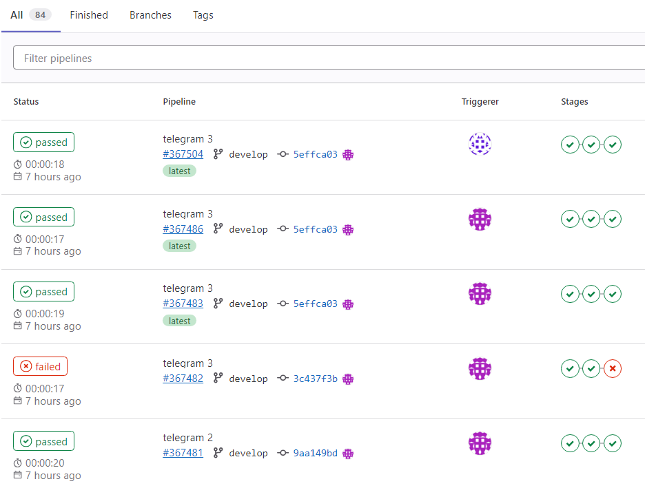
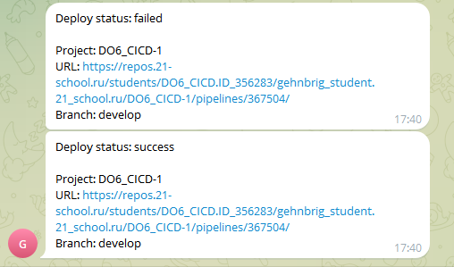

# Gitlab CI/CD

В рамках обучения, к старому проекту https://github.com/BatoBudaev/cat-grep добавил CI/CD. Написал файл конфигурации gitlab-ci.yml и скрипты для этапа "Deploy".
___
``CI/CD — это набор принципов и практик, которые позволяют чаще и надежнее развертывать изменения программного обеспечения.``  
``CI/CD pipeline - это последовательность действий (скриптов) для определенной версии кода в репозитории, которая запускается автоматически при совершении изменений.``  
___
  
___Рис. 1 - CI/CD pipelines___  
___
  
___Рис. 2 - Уведомления телеграм бота___  
___
